# Ledgerly — System Diagrams & Architecture Documentation

This document contains a comprehensive architectural and engineering diagram suite for **Ledgerly (Invoice Generator)**, covering system architecture, data models, state machines, sequence workflows, and data flow pipelines.

All 14 diagrams are rendered as **Ultra-HD High-Resolution PNG images** and **lossless vector SVG files** in the [`Project Diagrams/`](file:///c:/Users/Krushna/Documents/Projects/Invoice%20Generator/Project%20Diagrams) folder.

### 📁 Rendered Diagram Directory

| # | Diagram Title | High-Res PNG Image | Lossless Vector SVG |
|---|---|---|---|
| **01** | High-Level System Architecture | [01_system_architecture.png](file:///c:/Users/Krushna/Documents/Projects/Invoice%20Generator/Project%20Diagrams/01_system_architecture.png) | [01_system_architecture.svg](file:///c:/Users/Krushna/Documents/Projects/Invoice%20Generator/Project%20Diagrams/01_system_architecture.svg) |
| **02** | Entity-Relationship Diagram (ERD) | [02_entity_relationship_diagram.png](file:///c:/Users/Krushna/Documents/Projects/Invoice%20Generator/Project%20Diagrams/02_entity_relationship_diagram.png) | [02_entity_relationship_diagram.svg](file:///c:/Users/Krushna/Documents/Projects/Invoice%20Generator/Project%20Diagrams/02_entity_relationship_diagram.svg) |
| **03** | Route Navigation State Machine | [03_navigation_state_machine.png](file:///c:/Users/Krushna/Documents/Projects/Invoice%20Generator/Project%20Diagrams/03_navigation_state_machine.png) | [03_navigation_state_machine.svg](file:///c:/Users/Krushna/Documents/Projects/Invoice%20Generator/Project%20Diagrams/03_navigation_state_machine.svg) |
| **04** | Invoice Lifecycle State Machine | [04_invoice_lifecycle_state_machine.png](file:///c:/Users/Krushna/Documents/Projects/Invoice%20Generator/Project%20Diagrams/04_invoice_lifecycle_state_machine.png) | [04_invoice_lifecycle_state_machine.svg](file:///c:/Users/Krushna/Documents/Projects/Invoice%20Generator/Project%20Diagrams/04_invoice_lifecycle_state_machine.svg) |
| **05** | Sequence: Auth & Session Flow | [05_sequence_auth_and_session.png](file:///c:/Users/Krushna/Documents/Projects/Invoice%20Generator/Project%20Diagrams/05_sequence_auth_and_session.png) | [05_sequence_auth_and_session.svg](file:///c:/Users/Krushna/Documents/Projects/Invoice%20Generator/Project%20Diagrams/05_sequence_auth_and_session.svg) |
| **06** | Sequence: Invoice Builder & Signature | [06_sequence_invoice_builder_and_signature.png](file:///c:/Users/Krushna/Documents/Projects/Invoice%20Generator/Project%20Diagrams/06_sequence_invoice_builder_and_signature.png) | [06_sequence_invoice_builder_and_signature.svg](file:///c:/Users/Krushna/Documents/Projects/Invoice%20Generator/Project%20Diagrams/06_sequence_invoice_builder_and_signature.svg) |
| **07** | Sequence: Payment & Receipt Dispatch | [07_sequence_payment_and_receipt.png](file:///c:/Users/Krushna/Documents/Projects/Invoice%20Generator/Project%20Diagrams/07_sequence_payment_and_receipt.png) | [07_sequence_payment_and_receipt.svg](file:///c:/Users/Krushna/Documents/Projects/Invoice%20Generator/Project%20Diagrams/07_sequence_payment_and_receipt.svg) |
| **08** | DFD Level 0: Context Diagram | [08_dfd_level_0_context_diagram.png](file:///c:/Users/Krushna/Documents/Projects/Invoice%20Generator/Project%20Diagrams/08_dfd_level_0_context_diagram.png) | [08_dfd_level_0_context_diagram.svg](file:///c:/Users/Krushna/Documents/Projects/Invoice%20Generator/Project%20Diagrams/08_dfd_level_0_context_diagram.svg) |
| **09** | DFD Level 1: Functional Decomposition | [09_dfd_level_1_decomposition.png](file:///c:/Users/Krushna/Documents/Projects/Invoice%20Generator/Project%20Diagrams/09_dfd_level_1_decomposition.png) | [09_dfd_level_1_decomposition.svg](file:///c:/Users/Krushna/Documents/Projects/Invoice%20Generator/Project%20Diagrams/09_dfd_level_1_decomposition.svg) |
| **10** | Component & UI Module Hierarchy | [10_component_ui_hierarchy.png](file:///c:/Users/Krushna/Documents/Projects/Invoice%20Generator/Project%20Diagrams/10_component_ui_hierarchy.png) | [10_component_ui_hierarchy.svg](file:///c:/Users/Krushna/Documents/Projects/Invoice%20Generator/Project%20Diagrams/10_component_ui_hierarchy.svg) |
| **11** | Print & PDF Export Pipeline | [11_print_and_pdf_pipeline.png](file:///c:/Users/Krushna/Documents/Projects/Invoice%20Generator/Project%20Diagrams/11_print_and_pdf_pipeline.png) | [11_print_and_pdf_pipeline.svg](file:///c:/Users/Krushna/Documents/Projects/Invoice%20Generator/Project%20Diagrams/11_print_and_pdf_pipeline.svg) |
| **12** | DFD Level 0: Context Data Flow | [12_dfd_level_0_detailed_flow.png](file:///c:/Users/Krushna/Documents/Projects/Invoice%20Generator/Project%20Diagrams/12_dfd_level_0_detailed_flow.png) | [12_dfd_level_0_detailed_flow.svg](file:///c:/Users/Krushna/Documents/Projects/Invoice%20Generator/Project%20Diagrams/12_dfd_level_0_detailed_flow.svg) |
| **13** | DFD Level 1: Detailed Processes | [13_dfd_level_1_detailed_processes.png](file:///c:/Users/Krushna/Documents/Projects/Invoice%20Generator/Project%20Diagrams/13_dfd_level_1_detailed_processes.png) | [13_dfd_level_1_detailed_processes.svg](file:///c:/Users/Krushna/Documents/Projects/Invoice%20Generator/Project%20Diagrams/13_dfd_level_1_detailed_processes.svg) |
| **14** | DFD Level 2: Invoice & Payment Settlement | [14_dfd_level_2_invoice_and_payment.png](file:///c:/Users/Krushna/Documents/Projects/Invoice%20Generator/Project%20Diagrams/14_dfd_level_2_invoice_and_payment.png) | [14_dfd_level_2_invoice_and_payment.svg](file:///c:/Users/Krushna/Documents/Projects/Invoice%20Generator/Project%20Diagrams/14_dfd_level_2_invoice_and_payment.svg) |

---

## 1. High-Level System Architecture

A bird's-eye view of the single-page application (SPA), runtime environment, persistence model, and external integration points.

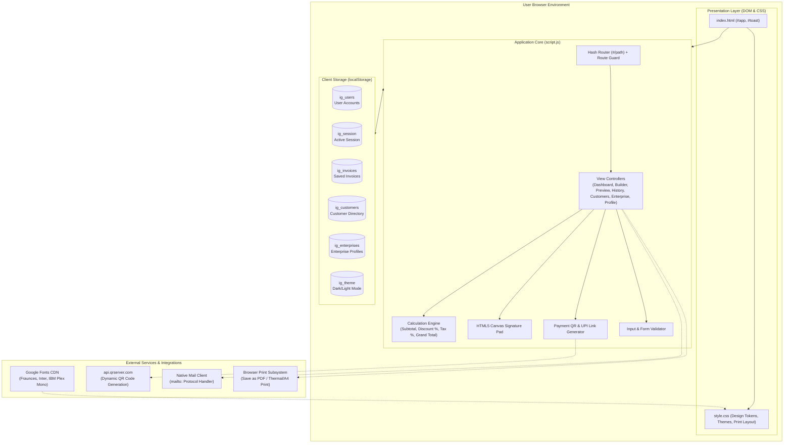

---

## 2. Entity-Relationship Diagram (ERD)

Data model relationship showing how users, enterprise profiles, customers, invoices, and line items are structured in `localStorage`.

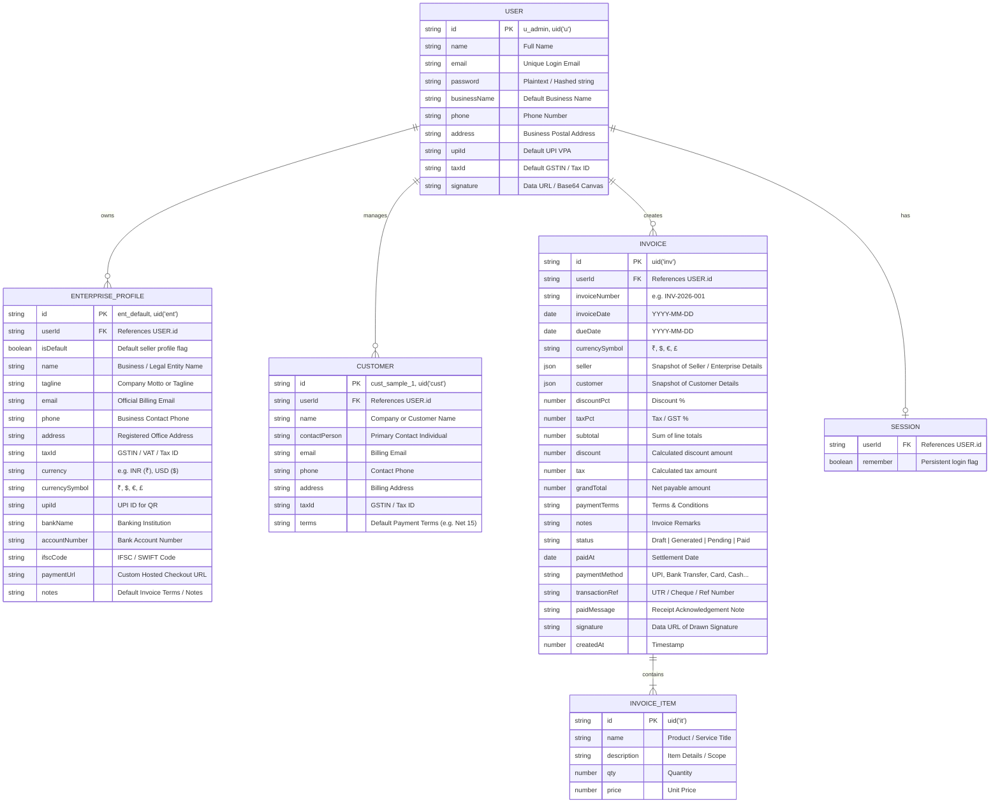

---

## 3. Application State & Route Navigation State Machine

Describes client-side hash routing, authenticated route protection, and navigational flow between views.

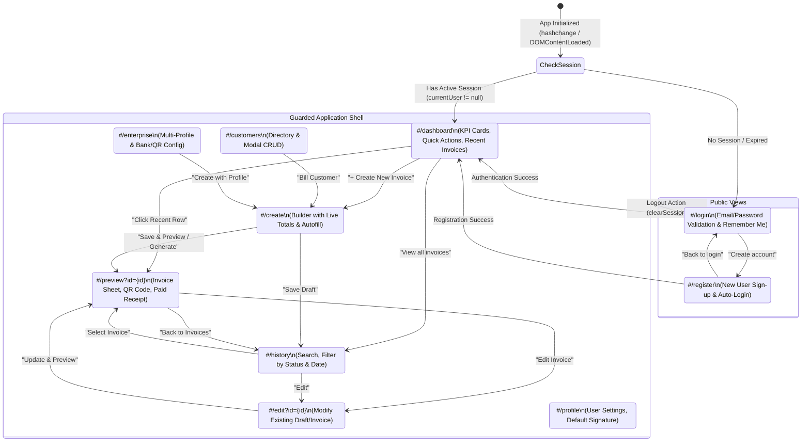

---

## 4. Invoice Lifecycle State Machine

Illustrates how an invoice transitions across lifecycle states from creation to settlement.

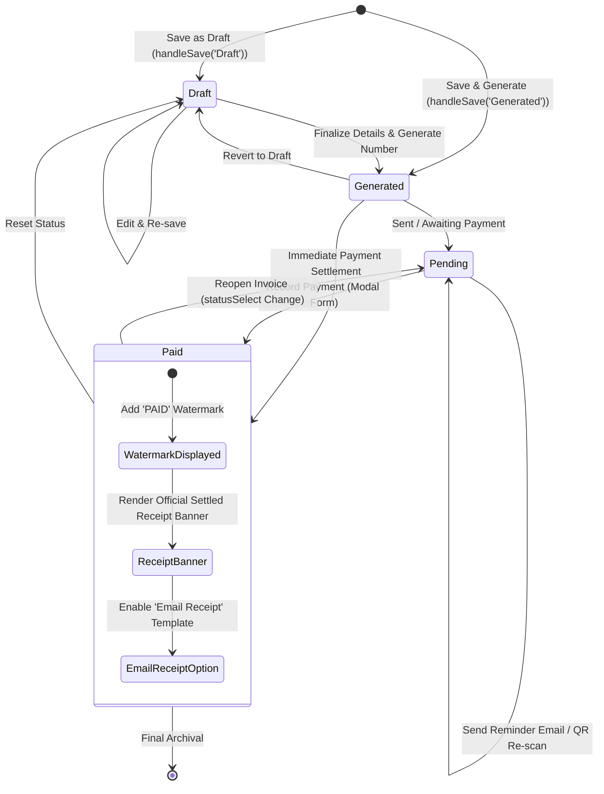

---

## 5. Sequence Diagram: Authentication & Session Flow

The interaction between the user, browser event listener, router guard, and `localStorage`.

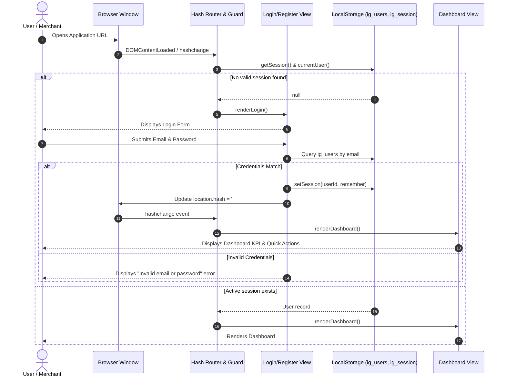

---

## 6. Sequence Diagram: Invoice Creation, Calculation & Signature

The data flow during invoice creation, including dynamic mathematics, profile autofill, and HTML5 canvas signature capture.

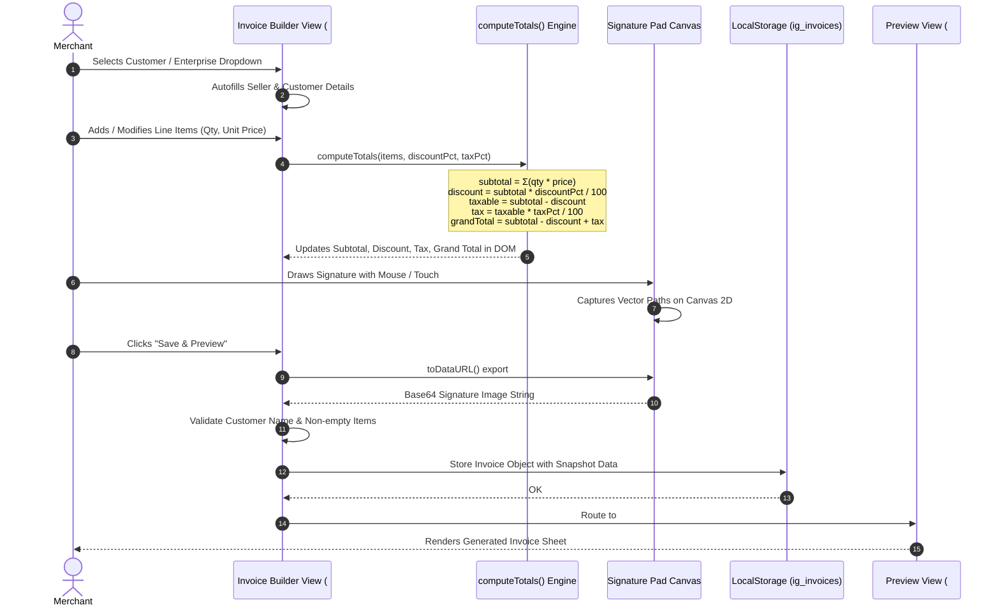

---

## 7. Sequence Diagram: Payment Recording, QR Code Generation & Receipt Dispatch

Shows how QR codes are dynamically requested and rendered, how payments are recorded, and how receipts are emailed or printed.

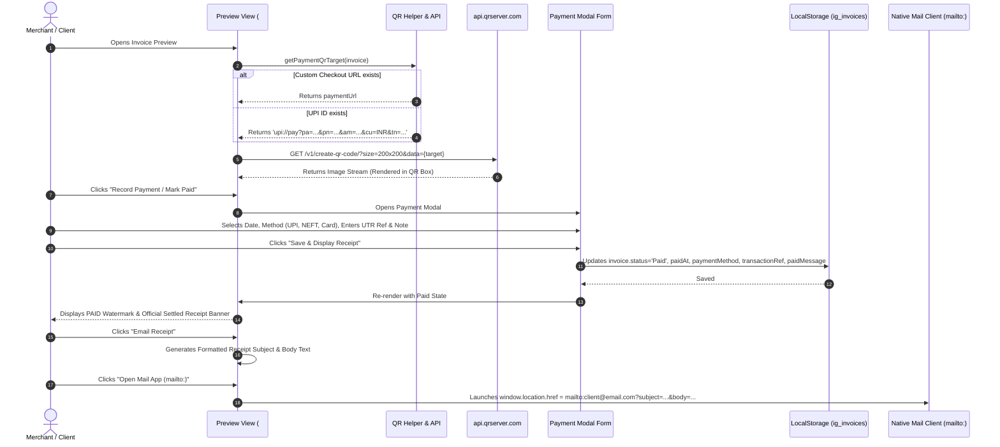

---

## 8. Data Flow Diagram (DFD Level 0 & Level 1)

### Level 0: Context Diagram
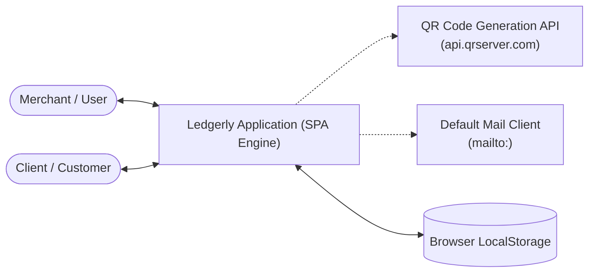

### Level 1: Functional Decomposition
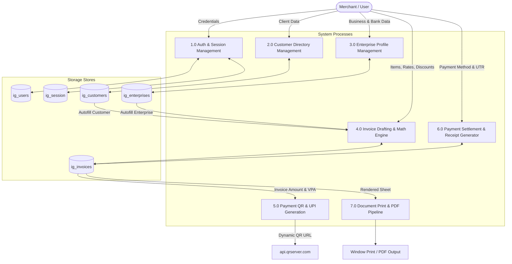

---

## 9. Component & UI Module Hierarchy

The composition of view templates, shared shell, and dynamic modals.

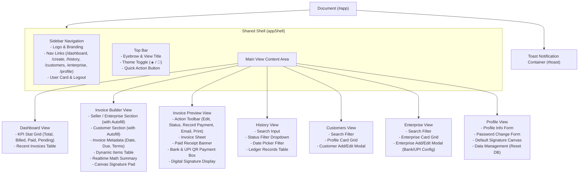

---

## 10. Print & PDF Export Execution Pipeline

Shows how CSS `@media print` rules transform the web view into a clean, borderless, single/multi-page A4 PDF invoice.

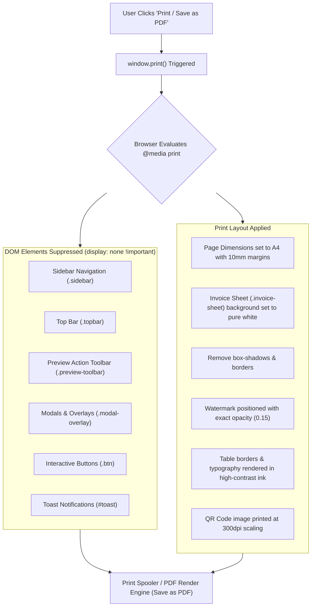

---

## Summary of Architecture & Technical Specifications

| Characteristic | Specification |
|---|---|
| **Architecture Type** | Client-Side Single Page Application (SPA) |
| **Frontend Technologies** | Vanilla JavaScript (ES6+), HTML5, Vanilla CSS3 |
| **State & Persistence** | Browser `localStorage` with JSON serialization (`DB.*` abstractions) |
| **Authentication** | Client-side session management with local credential verification and route guards |
| **Styling & Theming** | CSS Custom Properties (CSS variables) supporting dynamic Light / Dark mode |
| **Document Generation** | Native CSS `@media print` print layout engine converting DOM to standard A4 PDF |
| **External Dependencies** | Google Fonts, QR Server API (`api.qrserver.com`), zero npm build dependencies required |
